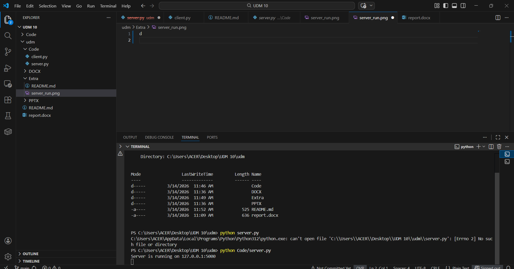

# TCP Chat Application

Simple TCP Chat Application using Python.

## Author
Hoàng Đình Phùng

## Project Structure

Code/
- server.py
- client.py

Extra/
- server_run.png

## How to Run

### Run Server

cd Code
python server.py

Server will run at:

127.0.0.1:5000

### Run Client

Open another terminal:

cd Code
python client.py

## Commands

/list      -> show online users  
/msg user  -> send message  
/exit      -> exit chat  

## Server Running

